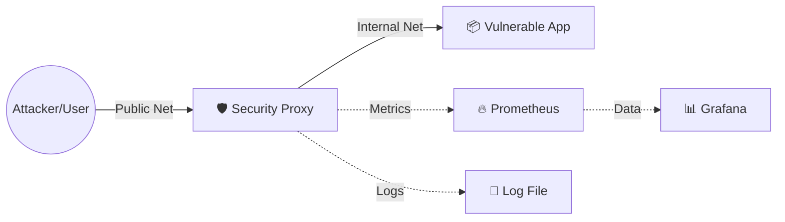

# 🛡️ Warehouse Security Pattern: Proxy, Deception & Monitoring


**Программно-аппаратный комплекс для защиты уязвимых веб-приложений и сервисов.**

Проект реализует паттерн **Security Proxy** с элементами **Cyber Deception** (Honeypot) и **Obfuscation**. Он скрывает реальную архитектуру легаси-приложения ("Warehouse ERP"), подменяет заголовки, эмулирует ложные сетевые службы и обеспечивает полный мониторинг инцидентов в реальном времени.

---

## 🏗️ Архитектура

Система построена на микросервисах в Docker. Внешний доступ к уязвимому приложению полностью закрыт и осуществляется только через защищенный Proxy-шлюз.



Компоненты системы:

📦 **Application (Vulnerable Target):**

- Эмуляция Legacy-системы (ERP).
- Открытые уязвимые порты: 5000 (Web), 5001 (DB), 5002 (Admin).
- Полностью изолирован во внутренней сети `internal-net`.

🛡️ **Security Proxy (The Core):**

- Python-приложение на сырых сокетах.
- Port 9000 (Web): Работает как WAF/Filter. Вырезает заголовки сервера (`Server: Warehouse`), скрывает версии ПО.
- Port 9001 (DB) & 9002 (Admin): Работают как Honeypot. Эмулируют SSH и Telnet сервисы, собирая данные об атаках и вводя злоумышленника в заблуждение.
- Logging: Пишет аудит всех событий на диск.

📊 **Monitoring Stack:**

- Prometheus: Сбор метрик с прокси каждые 5 секунд.
- Grafana: Визуализация атак (SOC Dashboard).

🚀 **Функциональные возможности**

### 1. Cyber Deception (Обман злоумышленника)
Вместо закрытия портов, система держит их открытыми для сбора Threat Intelligence.

- При попытке взлома Базы Данных (порт 9001) хакер видит фейковый баннер `SSH-2.0-OpenSSH`.
- Это заставляет сканеры уязвимостей (Nmap/Nessus) выдавать ложные отчеты и тратить время на подбор паролей к несуществующему сервису.

### 2. Obfuscation (Запутывание)
На веб-порту (9000) прокси на лету перехватывает HTTP-ответы:

- Удаляет заголовки `Server: Warehouse Internal`.
- Заменяет их на `Server: Apache/2.4`.
- Скрывает упоминания "Legacy Backend" в HTML-коде.

### 3. Observability & Audit

- Метрики: RPS, количество перехваченных атак, типы атак.
- Логи: Полный журнал событий (`logs/security_events.log`) с IP-адресами и временными метками.

🛠️ **Установка и запуск**

### Требования
- Docker & Docker Compose
- Python 3 (для запуска тестовых скриптов)

### Запуск
Клонируйте репозиторий:

```bash
git clone https://github.com/artemlen/OpenPortsSecurity.git
cd OpenPortsSecurity
```

Запустите стек контейнеров:

```bash
docker-compose up -d --build
```

Проверьте статус контейнеров:

```bash
docker ps
```

🧪 **Тестирование и Демонстрация**

### 1. Генерация трафика (Атака)
В проекте есть скрипт для нагрузочного тестирования и эмуляции атак. Запустите его, чтобы увидеть данные на графиках:

```bash
python scanner.py
```

Скрипт начнет отправлять запросы на порты 9000, 9001, 9002.

### 2. Доступ к дашбордам
Откройте Grafana в браузере:

- URL: http://localhost:3000
- Login: admin
- Password: admin

Преднастроенный дашборд покажет количество отраженных атак, распределение целей и скорость запросов.

### 3. Проверка логов
Логи сохраняются в папку `proxy_logs` в корне проекта.

```bash
tail -f proxy_logs/security_events.log
```

Пример лога:

```text
[2023-10-27 15:45:12] 172.18.0.1      -> :9001 | HONEYPOT_TRIGGER     | Атака перехвачена. Фейк: SSH-2.0...
[2023-10-27 15:45:13] 172.18.0.1      -> :9000 | OBFUSCATION          | Скрыты заголовки 'Warehouse'
```

📂 **Структура проекта**

```text
warehouse-security-pattern/
├── app/                 
│   ├── app.py                # Само защищаемое приложение
│   └── Dockerfile.app        # Необходим для сборки образа контейнера
├── monitoring/              
├── proxy/               
│   ├── Dockerfile.proxy      # Необходим для сборки образа контейнера
│   └── security.py           # Модуль защиты
├── proxy_logs/ 
│   └── security_events.log   # Логи модуля защиты
├── scanner/   
│   ├── scanner.py            # Выполняет запроосы на порты с подробным отчетом по найденным уязвимостям (модуль нападения)
│   └── spam.py               # Можно выполинть, если нужно много ччастых запросов на порты
├── docker-compose.yml        # Оркестрация
├── recon_report.json         # Файл отчета scanner.py
└── README.md
```

👨‍💻 **Автор**
Разработано в рамках учебного проекта по дисциплине "Разработка и Интеграция", а также "Виртуализация и контейнеризация".
